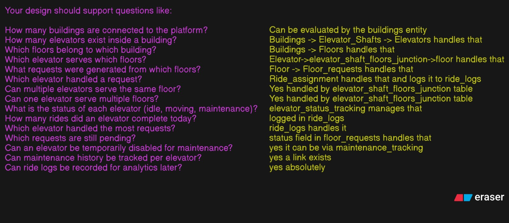
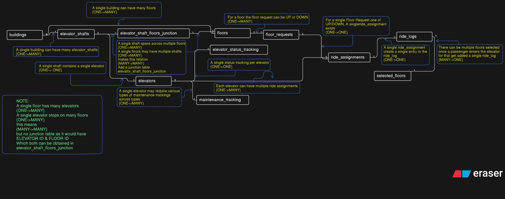
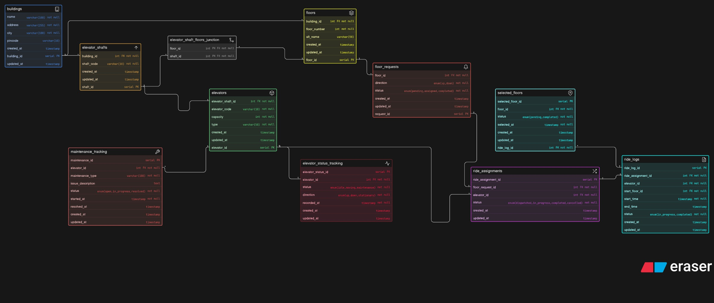

# LiftGrid Smart Elevator Control ER Design

Database design for a multi building intelligent elevator platform modeling buildings floors elevators requests ride assignments logs status tracking and maintenance history for scalable real world infrastructure management.

## Answers to the following section

What You Have to Do

1. Your design should support questions like:
2. How many buildings are connected to the platform?
3. How many elevators exist inside a building?
4. Which floors belong to which building?
5. Which elevator serves which floors?
6. What requests were generated from which floors?
7. Which elevator handled a request?
8. Can multiple elevators serve the same floor?
9. Can one elevator serve multiple floors?
10. What is the status of each elevator (idle, moving, maintenance)?
11. How many rides did an elevator complete today?
12. Which elevator handled the most requests?
13. Which requests are still pending?
14. Can an elevator be temporarily disabled for maintenance?
15. Can maintenance history be tracked per elevator?

## Thought Process

## ER Diagram

